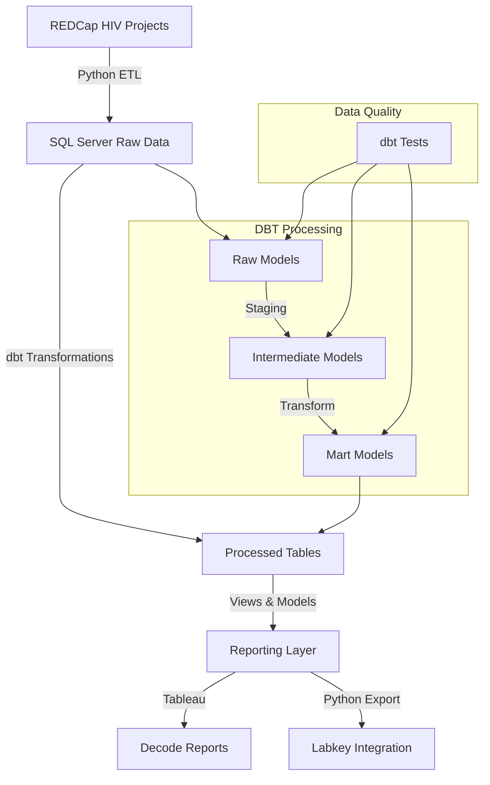

### HIV project data pipeline
This project is a data pipeline that processes data from the HIV project. This project pulls data from the REDCAP HIV projects and stores it in sqlserver. The data is then pulled into Tableau reports for Decode Reports and into labkey.

### Data Pipeline Flow


### Directory Structure
```
.
├── src/              # contains the source code for the project
├── data/             # contains the data for the project
├── logs/             # contains the logs for the project
├── config/           # contains the configuration files for the project
├── include/          # contains the include files for the project
├── dbt/             # dbt project files
│   └── hiv_project/ # main dbt project directory
│       ├── models/  # dbt transformation models
│       ├── macros/  # reusable SQL macros
│       └── tests/   # data tests
└── docs/            # Generated dbt documentation
```

### DBT Project
This project uses dbt (data build tool) for data transformation and modeling. The dbt project is located in the `dbt/hiv_project` directory and contains:
- SQL-based data models
- Data tests and validations
- Documentation for all models and transformations

### Documentation
The project documentation is:
- Generated using dbt docs
- Available in the `docs/` directory
- Hosted on GitHub Pages at [project-url]
- Contains complete data lineage and transformation documentation

### Database objects deployment
- [ ] Generate the db object definitions using the `create_ddl.py` script
- [ ] Create database objects using the ddl files in the `src/ddl_definitions` directory
- [ ] load the Tableau report definitions from the `rpt_HIVReportName.csv` file