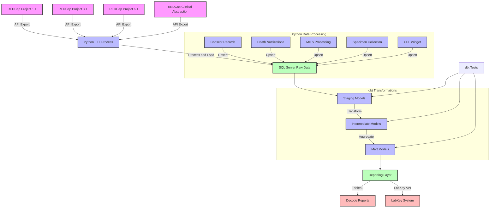

# HIV Project Data Pipeline

This project is a data pipeline that processes data from the HIV project. It pulls data from REDCap HIV projects, loads it into SQL Server (RDS), transforms it with dbt, and makes it available for Tableau reports (Decode Reports) and LabKey.

## Architecture

The pipeline runs on **AWS EC2 (t3.micro, 916 MB RAM)** with **RDS SQL Server** as the target database. Secrets are managed via **AWS Secrets Manager**. Logging goes to **CloudWatch** via watchtower, with failure/success notifications sent to **Slack**.

### Memory Constraints

The t3.micro instance has only **916 MB RAM** (~550 MB available after OS overhead). The REDCap flat export for Project 3.1 returns ~3974 records × 2080 columns, which requires **~1.7 GB peak memory** in a single request. The pipeline partitions this into record batches (`batch_size=50`, peak ~629 MB).

The pipeline **must run in 3 separate steps** to avoid OOM:
- `STEP=1`: REDCap export + LOAD
- `STEP=2`: dbt transformations
- `STEP=3`: UPSERTS (consent, death, MITS, specimen, CPL)

## Environment Setup

### Prerequisites

- **Python 3.12+** with [uv](https://docs.astral.sh/uv/) package manager
- **Git**
- **ODBC Driver 18 for SQL Server**
- **AWS CLI** with SSO profile (`CHAMPS-AWS-ADMINISTRATOR-DEV` for dev)
- **Access to REDCap API** with required tokens for projects 1.1, 3.1, 6.1, and CA
- **AWS Secrets Manager** secrets in the appropriate account

### Installation Steps

1. **Clone the repository**
   ```bash
   git clone <repo-url>
   cd hiv_project_etl
   ```

2. **Install uv** (if not already installed)
   ```bash
   curl -LsSf https://astral.sh/uv/install.sh | sh
   ```

3. **Install Python dependencies**
   ```bash
   uv sync
   ```

4. **Install ODBC Driver for SQL Server**
   - **macOS**:
     ```bash
     brew tap microsoft/mssql-release https://github.com/Microsoft/homebrew-mssql-release
     brew update
     brew install msodbcsql18 mssql-tools18
     ```
   - **Amazon Linux** (EC2):
     ```bash
     curl https://packages.microsoft.com/config/rhel/9/prod.repo | tee /etc/yum.repos.d/mssql-release.repo
     yum install -y msodbcsql18
     ```

5. **Configure AWS credentials**
   The pipeline uses AWS Secrets Manager for all credentials. No `.env` file is needed.
   ```bash
   aws sso login --profile CHAMPS-AWS-ADMINISTRATOR-DEV
   export AWS_PROFILE=CHAMPS-AWS-ADMINISTRATOR-DEV
   ```

   The environment is controlled by the `ENV` environment variable:
   ```bash
   export ENV=dev   # dev / stg / prod
   ```

   | Env | AWS Account ID | Secret Name |
   |-----|---------------|-------------|
   | dev | 192914852225 | champs/dev/rds_hiv_portal |
   | stg | 298660930181 | champs/stg/rds_hiv_portal |
   | prod | 600942988942 | champs/prod/rds_hiv_portal |

6. **Verify the setup**
   ```bash
   uv run python test_db_connection.py
   ```

### Running the Pipeline

```bash
# Step 1: REDCap export + load to staging
STEP=1 uv run python main.py

# Step 2: dbt transformations
STEP=2 uv run python main.py

# Step 3: Upserts (consent, death, MITS, specimen, CPL)
STEP=3 uv run python main.py

# Full pipeline (sequential) — NOT recommended on t3.micro, use ec2_run.sh
STEP=0 uv run python main.py
```

On EC2, use the wrapper script for cron scheduling:
```bash
bash ec2_run.sh dev
```

The `ec2_run.sh` script:
1. Exports DB credentials from Secrets Manager into environment variables
2. Runs the 3 steps sequentially with garbage collection between steps
3. Sends Slack notification on completion/failure

### Data Pipeline Flow


### Directory Structure
```
.
├── src/              # source code for the project
├── data/             # data files
├── logs/             # log files
├── config/           # configuration (SM-backed, no .env)
├── include/          # utility modules
├── dbt/              # dbt project files
│   └── hiv_project/  # main dbt project directory
│       ├── models/   # dbt transformation models
│       ├── macros/   # reusable SQL macros
│       ├── tests/    # data tests
│       └── profiles.yml  # in-project dbt profile
├── scripts/          # diagnostic and utility scripts
├── ec2_run.sh        # EC2 cron wrapper (sequential steps)
├── pyproject.toml    # Python dependencies (uv)
├── uv.lock           # Locked dependency versions
└── docs/             # Generated dbt documentation
```

### DBT Project

The dbt project is in `dbt/hiv_project/`. The profile is stored **in-project** (`profiles.yml`) rather than at `~/.dbt/profiles.yml`. Connection credentials are injected via environment variables set by `ec2_run.sh` or `main.py:_export_db_creds()`.

To run dbt manually:
```bash
cd dbt/hiv_project
uv run dbt deps    # Only needed when packages.yml changes
uv run dbt run
uv run dbt test
```

### Deployment

Build and deploy the artifact to EC2 via SSM:

```bash
# Build tar (--no-xattrs prevents macOS extended attribute warnings on Linux)
tar --no-xattrs -czf hiv_project_etl.tar.gz \
  --exclude='__pycache__' --exclude='.git' --exclude='.venv' \
  --exclude='*.pyc' --exclude='.DS_Store' \
  .

# Upload to S3
aws s3 cp hiv_project_etl.tar.gz s3://champs-aws-etl-scripts-dev/

# Deploy on EC2 via SSM
aws ssm send-command \
  --document-name "AWS-RunShellScript" \
  --targets "Key=tag:Name,Values=CHAMPS-EC2-REDCAP-ETL-DEV" \
  --parameters 'commands=["cd /mnt/etl && sudo -u ssm-user aws s3 cp s3://champs-aws-etl-scripts-dev/hiv_project_etl.tar.gz - | sudo -u ssm-user tar xzf -"]' \
  --comment "Deploy hiv_project_etl"
```

## REDCap Projects

| Project | Data Format | Sites | Staging Table | Notes |
|---------|------------|-------|---------------|-------|
| 1.1 - Adult HIV Study | EAV | Kenya, Mozambique, Sierra Leone, South Africa | `stg.HIVProject1_1_stg` | Has `site_id` field |
| 3.1 - Adult HIV Follow-up | **Flat** (partitioned) | All sites (single token) | `stg.HIVProject3_1_stg` | Partitioned by record batches; `site_id` sourced from `hiv_project_3_1` |
| 6.1 - Enhanced HIV Surveillance | EAV | All sites | `stg.HIVProject6_1_stg` | Repeat instruments/instances |
| Clinical Abstraction | EAV | All sites | `stg.HIVClinicalAbstract_stg` | |

**Note**: Project 3.1 returns **~3974 records × 2080 columns** in flat mode. REDCap ignores `page`/`pageSize` for this project, so the data is fetched by partitioning by record IDs via the `records[]` parameter (`batch_size=50`).

## Key Technical Details

### Memory Optimization
- Project 3.1 flat export is partitioned by record ID batches (`batch_size=50`)
- 3 pipeline steps run as separate Python processes to free memory between phases
- Peak memory: ~629 MB (vs ~1.7 GB for a single unpaginated call)

### South Africa site_id Workaround
Three records (IDs 992, 1497, 3081-257) have an empty `site_id`. The REDCap project does not include `site_id` as an export field. The pipeline sets `site_id = "001"` for these records in the EAV path.

### Split Execution
The pipeline splits into 3 steps to fit the t3.micro's 916 MB RAM:
- **STEP=1**: Export REDCap data + load to staging tables
- **STEP=2**: dbt run (staging → intermediate → mart)
- **STEP=3**: Upserts (consent, death, MITS, specimen, CPL)

### CloudWatch Logging
Logs are streamed to CloudWatch Log group `/champs/etl/hiv-project` with environment-specific log streams.

### Slack Notifications
Pipeline start/complete/failure notifications are sent via Slack webhook (token/channel from Secrets Manager).

## Troubleshooting

### OOM / SSM Agent Unreachable
If the EC2 instance runs out of memory, the SSM agent may be killed. Commands will show as `Undeliverable`. Reboot the instance to restore SSM connectivity, then ensure the pipeline runs via `ec2_run.sh` (sequential steps).

### dbt Connection Fails
- Verify the SM secret has correct credentials
- Check `encrypt: yes` and `trust_cert: yes` in `profiles.yml`
- ODBC Driver 18 must be installed

### REDCap API Errors
- Verify API tokens in the SM secret
- Check REDCap API URL accessibility
- `site_id` workaround may need updating if new empty-site_id records appear

### tar Warnings on Linux
On macOS, always use `--no-xattrs` when creating the tar archive to avoid `LIBARCHIVE.xattr` warnings on Linux EC2.
