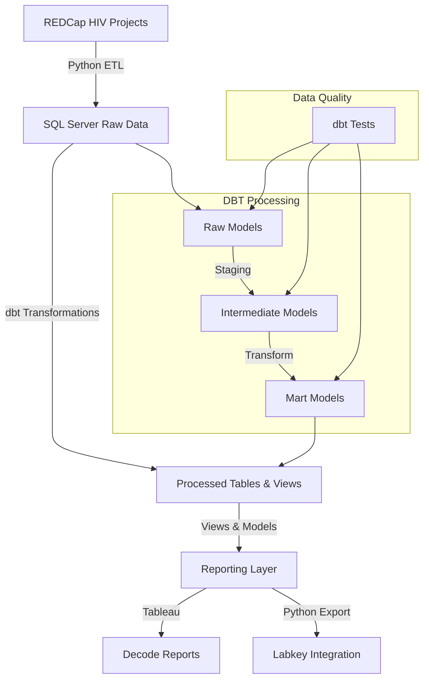

# HIV Project Data Pipeline

This project is a data pipeline that processes data from the HIV project. This project pulls data from the REDCAP HIV projects and stores it in sqlserver. The data is then pulled into Tableau reports for Decode Reports and into labkey.

## Environment Setup

### Prerequisites

- **Python 3.8+** with pip
- **Git**
- **ODBC Driver 17+ for SQL Server**
- **Access to SQL Server database** with appropriate permissions
- **Access to REDCap API** with required tokens for projects 1.1, 3.1, and CA
- **Required Python packages** (will be installed via requirements.txt):
  - dbt-core and dbt-sqlserver
  - pandas and numpy for data processing
  - pyodbc for database connectivity
  - python-dotenv for environment management
  - labkey for LabKey Server integration (optional)
  - Other dependencies as listed in requirements.txt

### Installation Steps

1. **Clone the repository**
   ```bash
   git clone https://github.service.emory.edu/TFGH/hiv_project_etl.git
   cd hiv_project_etl
   ```

2. **Set up Python environment**
   - Ensure Python 3.8+ is installed
   - Create and activate a virtual environment:
     ```bash
     python -m venv venv
     
     # On macOS/Linux:
     source venv/bin/activate
     
     # On Windows:
     .\venv\Scripts\activate
     ```

3. **Install Python dependencies**
   ```bash
   pip install -r requirements.txt
   ```

4. **Install ODBC Driver for SQL Server**
   - **macOS**:
     ```bash
     brew tap microsoft/mssql-release https://github.com/Microsoft/homebrew-mssql-release
     brew update
     brew install msodbcsql17 mssql-tools
     ```
   - **Ubuntu/Debian**:
     ```bash
     curl https://packages.microsoft.com/keys/microsoft.asc | apt-key add -
     curl https://packages.microsoft.com/config/ubuntu/$(lsb_release -rs)/prod.list > /etc/apt/sources.list.d/mssql-release.list
     apt-get update
     ACCEPT_EULA=Y apt-get install -y msodbcsql17
     ```

5. **Configure environment variables**
   Create a `.env` file in the project root with the required variables:
   ```bash
   # Environment (dev/staging/prod)
   ENV=dev
   
   # Database Configuration
   DB_SERVER=your_sql_server
   DB_DATABASE=your_database
   DB_USERNAME=your_username
   DB_PASSWORD=your_password
   
   # REDCap Configuration
   REDCAP_API_URL=your_redcap_api_url
   REDCAP_API_TOKEN_11=your_redcap_project_11_token
   REDCAP_API_TOKEN_31=your_redcap_project_31_token
   REDCAP_API_TOKEN_CA=your_redcap_ca_token
   
   # Optional: LabKey Configuration
   # LABKEY_SERVER=your_labkey_server
   # LABKEY_USERNAME=your_labkey_username
   # LABKEY_PASSWORD=your_labkey_password
   ```

6. **Set up dbt**
   - Install dbt-sqlserver:
     ```bash
     pip install dbt-sqlserver
     ```
   - Configure dbt profiles in `~/.dbt/profiles.yml`:
     ```yaml
     hiv_project:
       target: dev
       outputs:
         dev:
           type: sqlserver
           driver: 'ODBC Driver 17 for SQL Server'
           server: "{{ env_var('DB_SERVER') }}"
           port: 1433
           database: "{{ env_var('DB_DATABASE') }}"
           schema: dbo
           authentication: sql
           user: "{{ env_var('DB_USERNAME') }}"
           password: "{{ env_var('DB_PASSWORD') }}"
           encrypt: true
           trust_cert: true
     ```

7. **Verify the setup**
   - Test database connection:
     ```bash
     python -c "from src.db_utils import test_db_connection; test_db_connection()"
     ```
   - Test dbt connection:
     ```bash
     cd dbt/hiv_project
     dbt debug
     ```

### Running the Pipeline

1. **Activate virtual environment** (if not already active)
   ```bash
   source venv/bin/activate
   ```

2. **Run the full pipeline**
   ```bash
   python main.py
   ```

3. **Run dbt transformations only**
   ```bash
   cd dbt/hiv_project
   dbt run
   ```

4. **Run dbt tests**
   ```bash
   cd dbt/hiv_project
   dbt test
   ```

### Data Pipeline Flow


### Directory Structure
```
.
├── src/              # contains the source code for the project
├── data/             # contains the data for the project
├── logs/             # contains the logs for the project
├── config/           # contains the configuration files for the project
├── include/          # contains the include files for the project
├── dbt/             # dbt project files
│   └── hiv_project/ # main dbt project directory
│       ├── models/  # dbt transformation models
│       ├── macros/  # reusable SQL macros
│       └── tests/   # data tests
└── docs/            # Generated dbt documentation
```

### DBT Project
This project uses dbt (data build tool) for data transformation and modeling. The dbt project is located in the `dbt/hiv_project` directory and contains:
- SQL-based data models
- Data tests and validations
- Documentation for all models and transformations

### Documentation
The project documentation is:
- Generated using dbt docs
- Available in the `docs/` directory
- Hosted on GitHub Pages at [project-url]
- Contains complete data lineage and transformation documentation

### Database Objects Deployment

Follow these steps to set up the database objects:

1. **Generate database object definitions**
   ```bash
   python create_ddl.py
   ```

2. **Create database objects**
   - Navigate to the `src/ddl_definitions` directory
   - Execute the DDL files in your SQL Server database in the following order:
     - Tables first
     - Views second
     - Stored procedures last

3. **Load Tableau report definitions**
   ```bash
   # Load report definitions from CSV file
   python -c "
   import pandas as pd
   from src.database import load_data
   df = pd.read_csv('rpt_HIVReportName.csv')
   load_data(df, 'report_definitions_table')
   "
   ```

### Troubleshooting

#### Common Issues

1. **dbt connection fails**
   - Verify database credentials in `.env` file
   - Check if SQL Server is accessible from your network
   - Ensure ODBC Driver 17 for SQL Server is installed

2. **REDCap API errors**
   - Verify API token has correct permissions
   - Check if API URL is accessible
   - Ensure token hasn't expired

3. **Python package conflicts**
   - Use virtual environment
   - Update pip: `pip install --upgrade pip`
   - Reinstall requirements: `pip install -r requirements.txt --force-reinstall`

#### Environment Variables
Make sure all required environment variables are set:
```bash
# Check if variables are set
echo $DB_SERVER
echo $DB_DATABASE
# etc.
```