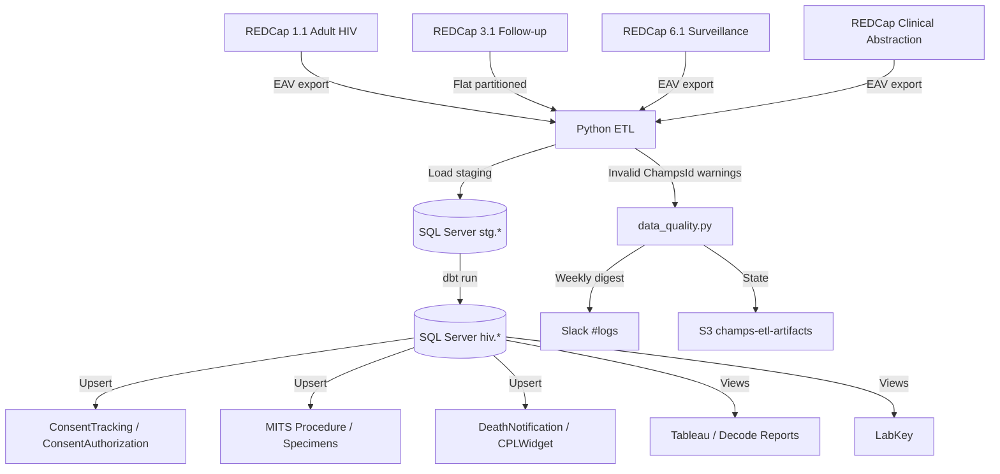

# HIV Project Data Pipeline

ETL pipeline for the CHAMPS HIV Project. Pulls data from REDCap, loads to SQL Server (RDS), transforms with dbt, and surfaces data for Tableau (Decode Reports) and LabKey.

## Architecture

| Component | Details |
|---|---|---|
| Compute | ECS Fargate (per‑environment cluster) |
| Database | RDS SQL Server (`hiv` schema) |
| Networking | Per‑env SG (`champs-{env}-hiv-etl-sg`) — egress to RDS (port 1433) via `referenced_security_group_id` |
| RDS SG Ingress | Owned by `champs-aws-champs-db` Terraform project — do not add ingress rules here |
| Secrets | AWS Secrets Manager |
| Logging | CloudWatch (`/ecs/hiv-project-etl`) |
| Notifications | Slack (`#logs`) — pipeline success/failure + weekly DQ digest |
| Artifacts | S3 `champs-{env}-etl-artifacts` (state files, diagnostics) |

### Pipeline Steps

The pipeline runs in 3 steps to manage memory (Project 3.1 flat export requires ~1.7 GB peak):

| Step | Command | What it does |
|---|---|---|
| 1 | `STEP=1` | REDCap API export → load to staging tables |
| 2 | `STEP=2` | dbt run (19 models: staging, tables, views) |
| 3 | `STEP=3` | Upserts: ConsentTracking, ConsentAuthorization, DeathNotification, MITSProcedure, MITSSpecimensCollected, CPLWidgetAggregate |

Run all steps: `STEP=0` (or omit `STEP`).

### Data Pipeline Flow


## Environment Setup

### Prerequisites

- **Python 3.12+** with [uv](https://docs.astral.sh/uv/)
- **ODBC Driver 18 for SQL Server**
- **AWS CLI** with SSO configured
- REDCap API tokens + Secrets Manager access

### Installation

```bash
git clone git@github.com:champshealth/hiv_project_etl.git
cd hiv_project_etl
uv sync
```

**ODBC Driver (macOS):**
```bash
brew tap microsoft/mssql-release https://github.com/Microsoft/homebrew-mssql-release
brew install msodbcsql18 mssql-tools18
```

**ODBC Driver (Amazon Linux / ECS container):**
```bash
curl https://packages.microsoft.com/config/rhel/9/prod.repo | tee /etc/yum.repos.d/mssql-release.repo
yum install -y msodbcsql18
```

### AWS Credentials

No `.env` file needed — all credentials come from Secrets Manager.

```bash
aws sso login --profile CHAMPS-AWS-ADMINISTRATOR-DEV
export AWS_PROFILE=CHAMPS-AWS-ADMINISTRATOR-DEV
export APP_ENV=dev   # dev | prod
```

| Env | AWS Account | DB Secret |
|---|---|---|
| dev | 192914852225 | `champs/dev/rds_hiv_portal` |
| prod | 600942988942 | `champs/prod/rds_hiv_portal` |

### Running the Pipeline

```bash
# Individual steps
APP_ENV=dev STEP=1 uv run python main.py   # Export + load
APP_ENV=dev STEP=2 uv run python main.py   # dbt
APP_ENV=dev STEP=3 uv run python main.py   # Upserts

# Full pipeline
APP_ENV=dev STEP=0 uv run python main.py
```

On ECS Fargate (scheduled), the pipeline is triggered by EventBridge Scheduler. Create a run-task override to test:
```bash
aws ecs run-task --cluster champs-{env}-hiv-etl --task-definition champs-{env}-hiv-etl:1 \
  --launch-type FARGATE \
  --network-configuration 'awsvpcConfiguration={subnets=[...],securityGroups=[sg-...],assignPublicIp=DISABLED}' \
  --overrides '{"containerOverrides":[{"name":"champs-{env}-hiv-etl","environment":[{"name":"STEP","value":"0"}]}]}'
```

## Directory Structure

```
.
├── src/                        # ETL source modules
│   ├── db_load_project_*.py    # REDCap staging loaders
│   ├── db_upsert_*.py          # Target table upserts
│   ├── data_quality.py         # ChampsId DQ warning + weekly Slack digest
│   ├── log_checker.py          # Post-run log error checker
│   └── ddl_definitions/        # SQL DDL reference files
├── config/
│   ├── config.py               # All constants (SM-backed, no .env)
│   └── redcap_tokens.yaml      # Token key mapping
├── include/                    # Shared utilities (AWS, Slack, CI)
├── dbt/hiv_project/
│   ├── models/views/           # dbt view models (19 total)
│   ├── profiles.yml            # In-project profile (uses DB_* env vars)
│   └── dbt_project.yml
├── scripts/                    # Diagnostic / test scripts
├── data_dictionaries/          # REDCap data dictionary CSVs
├── ec2_run.sh                  # EC2 cron wrapper
├── pyproject.toml              # Python dependencies (uv)
└── uv.lock
```

## REDCap Projects

| Project | Format | Staging Table | Notes |
|---|---|---|---|
| 1.1 Adult HIV Study | EAV | `stg.HIVProject1_1_stg` | ChampsId validated (`^[A-Za-z]{4}\d{5}$`) |
| 3.1 Adult HIV Follow-up | Flat (partitioned) | `stg.HIVProject3_1_stg` | `batch_size=50` records; ~3974 records × 2080 cols |
| 6.1 Enhanced Surveillance | EAV | `stg.HIVProject6_1_stg` | Repeat instruments |
| Clinical Abstraction | EAV | `stg.HIVClinicalAbstract_stg` | |

## Security Group Architecture

Each environment has its own security group (`champs-{env}-hiv-etl-sg`) created and managed by this project's Terraform (`networking.tf`). The SG allows outbound HTTPS to the internet and outbound SQL Server (port 1433) to the RDS SG.

The **ingress** rules on the RDS security group are **not** managed here. They are owned by the canonical DB project at [`champs-aws-champs-db`](https://github.com/champshealth/champs-aws-champs-db), which adds ingress rules for each ETL project's SG by name lookup:

```
data "aws_security_group" "hiv_etl" {
  name = "champs-${var.environment}-hiv-etl-sg"
}

resource "aws_vpc_security_group_ingress_rule" "rds_from_hiv_etl" {
  security_group_id            = aws_security_group.rds.id
  referenced_security_group_id = data.aws_security_group.hiv_etl.id
  from_port                    = 1433
  to_port                      = 1433
  ip_protocol                  = "tcp"
}
```

This same pattern is also followed by the pathology ETL project (`integrated_pathogy_form_etl`) — all ETL-to-RDS ingress is centralized in the DB project to avoid split-ownership anti-patterns.

To view the current ingress rules on the RDS SG:
```bash
aws ec2 describe-security-group-rules --filter Name="group-id",Values="$(terraform output -raw security_group_id)" \
  --query 'SecurityGroupRules[?Direction==`ingress`].[SecurityGroupRuleId,Description]' --output table
```

## Key Technical Details

### ChampsId Validation
Project 1.1 records are validated on load: `ChampsId` must match `^[A-Za-z]{4}\d{5}$` (4 letters + 5 digits). Invalid records are excluded from staging with a `WARNING` log. Invalid IDs are accumulated across runs and posted as a **weekly Slack digest** to `#logs` (state persisted in S3 at `champs-etl-artifacts/hiv_project_etl/champs_id_warnings_state.json`).

### Memory Management
- Project 3.1 flat export partitioned into `batch_size=50` record batches (~629 MB peak vs ~1.7 GB unpaginated)
- 3 pipeline steps run as separate invocations to release memory between phases

### South Africa site_id
Three records (IDs 992, 1497, 3081-257) have an empty `site_id`. The pipeline defaults to `site_id = "001"` for these.

### dbt Profile
Stored in-project at `dbt/hiv_project/profiles.yml`. Credentials injected via `DB_*` environment variables set by `main.py:_export_db_creds()`. Always pass `--profiles-dir .` when running dbt manually:
```bash
cd dbt/hiv_project
uv run dbt run --profiles-dir . --target dev
uv run dbt test --profiles-dir . --target dev
```

### CloudWatch Logs
| Log Group | Stream prefix |
|---|---|
| `/ecs/hiv-project-etl` | `{env}/` (e.g. `dev/618c2567...`) |

```bash
# Tail live
aws logs tail /ecs/hiv-project-etl --log-stream-name-prefix dev --follow --format short
```

## Troubleshooting

### dbt Connection Fails
- Confirm `DB_*` env vars are set (run `STEP=2` only after `_export_db_creds()` has run, or set manually)
- Check `encrypt: yes` and `trust_cert: yes` in `profiles.yml`
- ODBC Driver 18 must be installed

### REDCap API Errors
- Verify tokens in the SM secret (`champs/<env>/rds_hiv_portal`)
- Check `site_id` workaround if new empty-site_id records appear in Project 1.1

### OOM on EC2
- Use `ec2_run.sh` which runs steps sequentially with GC between them
- Do not run `STEP=0` on memory-constrained instances
