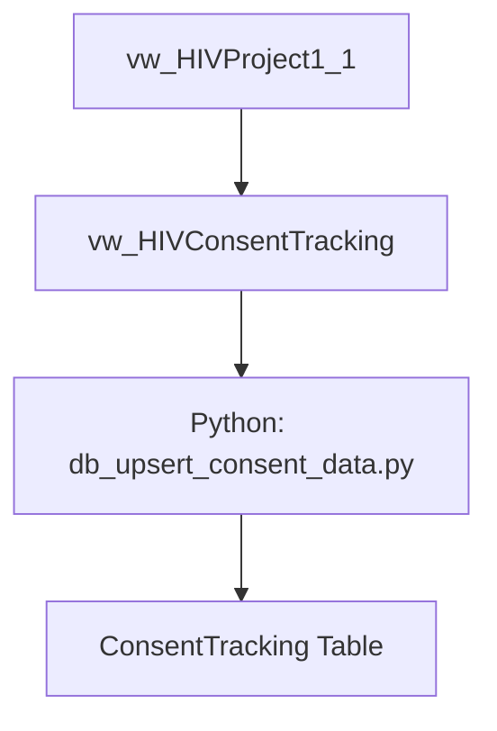

# HIV Project Data Pipeline

## Consent Tracking Process

### Process Overview
The consent tracking pipeline combines dbt transformations with a Python ETL process:

1. **vw_HIVConsentTracking** (dbt view)
   - Transforms raw consent data from vw_HIVProject1_1
   - Filters for completed consent forms (consent_tracking_complete = '2')
   - Filters for specific consent type (mits_type = 'CH00050')

2. **db_upsert_consent_data.py** (Python ETL)
   - Performs MERGE operations for new/updated records
   - Handles deduplication (sets duplicates to Active = 0)
   - Manages deleted records (sets to Active = 2)
   - Provides detailed logging of affected records